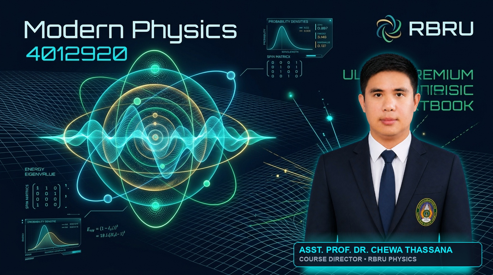

# ฟิสิกส์ยุคใหม่ (Modern Physics) — RBRU MOOC 4012920



> **รายวิชา:** ฟิสิกส์ยุคใหม่ (Modern Physics) รหัส 4012920  
> **อาจารย์ผู้รับผิดชอบ:** ผู้ช่วยศาสตราจารย์ ดร.ชีวะ ทัศนา  
> **มหาวิทยาลัย:** มหาวิทยาลัยราชภัฏรำไพพรรณี (RBRU)  
> **ระบบ E-Learning:** [elearning.rbru.ac.th/course/view.php?id=262](https://elearning.rbru.ac.th/course/view.php?id=262)

---

## 🌐 เปิดใช้งาน Interactive Course Portal

**👉 [https://tsanaphy2023.github.io/modernphysics/](https://tsanaphy2023.github.io/modernphysics/)**

แพลตฟอร์มการเรียนรู้ Online ที่รวม:
- **40 หัวข้อย่อยแยกเพจ** (8 บทเรียน × 5 หน้าย่อย) พร้อมระบบนำทางสมบูรณ์แบบ
- **Live Computation Simulators** — ปรับค่าตัวแปรและเห็นผลการคำนวณทันที
- **Worked Examples & Concept Check Quiz** ตรวจคำตอบอัตโนมัติพร้อมคำอธิบาย
- **3D AR Physics Studio** — ห้องทดลองเสมือนจริง สไตล์ MediaPipe + Three.js

---

## 📚 โครงสร้างรายวิชา (8 บทเรียน)

| บทที่ | หัวข้อ | หัวข้อย่อย |
|:---:|:---|:---|
| 1 | จุดกำเนิดของทฤษฎีควอนตัม | 1.1 – 1.5 |
| 2 | ทฤษฎีสัมพัทธภาพพิเศษ | 2.1 – 2.5 |
| 3 | ทวิภาวะของคลื่นและอนุภาค | 3.1 – 3.5 |
| 4 | กลศาสตร์ควอนตัม | 4.1 – 4.5 |
| 5 | ทฤษฎีอะตอมและสเปกตรัม | 5.1 – 5.5 |
| 6 | ฟิสิกส์นิวเคลียร์ | 6.1 – 6.5 |
| 7 | ฟิสิกส์อนุภาคมูลฐาน | 7.1 – 7.5 |
| 8 | ความรู้เบื้องต้นเกี่ยวกับเอกภพวิทยา | 8.1 – 8.5 |

---

## 📁 โครงสร้างไฟล์

```
modernphysics/
├── index.html                                      # GitHub Pages Entry Point (Interactive App)
├── assets/
│   └── images/
│       ├── modern_physics_banner.jpg               # แบนเนอร์หลักใช้งาน (Version 3)
│       ├── modern_physics_banner_v1_pure_scifi.jpg # Version 1: กราฟิกไซไฟฟิสิกส์ล้วน
│       ├── modern_physics_banner_v2_ai_synth.jpg   # Version 2: AI Synthesized Portrait
│       ├── modern_physics_banner_v3_exact_portrait.jpg # Version 3: ภาพถ่ายจริง ผศ.ดร.ชีวะ ทัศนา (Exact Portrait + Cyber Glow)
│       └── chewa_portrait_cutout.png               # ภาพไดคัทความละเอียดสูง
├── หนังสือ-เล่ม1-ฟิสิกส์ยุคใหม่/
│   ├── course_data.json                            # ข้อมูลทั้ง 8 บท / 40 หัวข้อย่อย
│   ├── make_course_json.py                         # สร้าง course_data.json
│   ├── render_course.py                            # Renderer หลักสำหรับ Generate ไฟล์ทั้งหมด
│   ├── RBRU_MOOC_Modern_Physics_Interactive.html   # Master Interactive App
│   ├── MOOC_Course_Structure_Separated_Pages.md    # คู่มือการนำเข้า Moodle
│   └── moodle_pages/
│       ├── section_0_banner_overview.html          # แบนเนอร์สำหรับ Section 0 ใน Moodle
│       ├── chapter_1/                              # page_1_1.html … page_1_5.html
│       ├── chapter_2/                              # page_2_1.html … page_2_5.html
│       ├── chapter_3/ … chapter_8/
```

---

## 🖼️ แกลเลอรีแบนเนอร์แต่ละเวอร์ชัน (Banner Versions Archive)

- **Version 1 (Pure Sci-Fi):** `assets/images/modern_physics_banner_v1_pure_scifi.jpg` (กราฟิกฟังก์ชันคลื่นควอนตัม โครงข่ายกาลอวกาศ และ HUD วิทยาศาสตร์)
- **Version 2 (AI Synthesized):** `assets/images/modern_physics_banner_v2_ai_synth.jpg` (เวอร์ชันประมวลผลผ่าน AI)
- **Version 3 (Exact Real Portrait - Active):** `assets/images/modern_physics_banner_v3_exact_portrait.jpg` (ภาพถ่ายจริงของ ผศ.ดร.ชีวะ ทัศนา ไดคัทคมชัด 100% เกลี่ยแสงขอบนีออนไซเบอร์ `#00f0ff` กลมกลืนกับพื้นหลังอวกาศ)


---

## 🛠️ วิธีสร้างไฟล์ใหม่ (Re-generate)

```bash
cd "หนังสือ-เล่ม1-ฟิสิกส์ยุคใหม่"
python3 make_course_json.py      # สร้าง/อัพเดท course_data.json
python3 render_course.py         # สร้างไฟล์ HTML ทั้งหมด + index.html
```

---

## 📝 License

เนื้อหาวิชาการ © 2026 มหาวิทยาลัยราชภัฏรำไพพรรณี (RBRU) — สงวนลิขสิทธิ์  
ซอร์สโค้ดและเครื่องมือสร้างรายวิชา: MIT License
